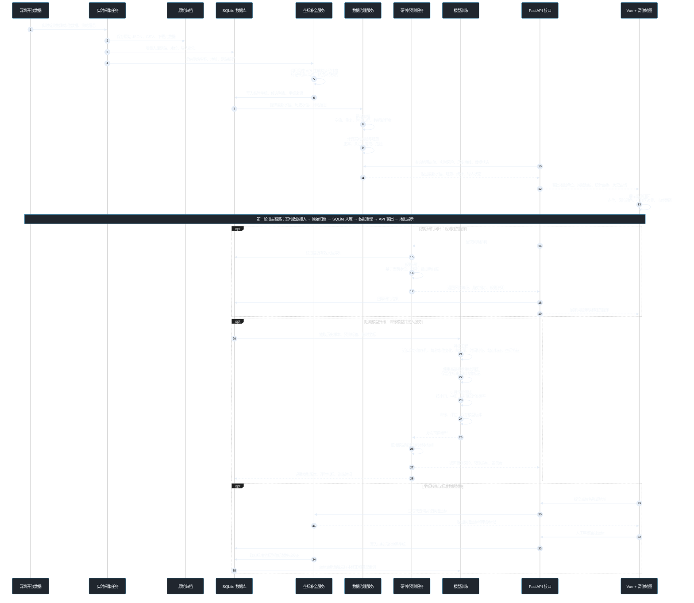

# 深圳市积水监测与预测系统调用链图

本文档用一张可直接渲染、可编辑的 Mermaid 调用链图说明深圳市积水监测与预测系统的主流程。系统先打通“实时水位接入、数据治理、坐标补全、接口服务、地图展示”的监测闭环；初期基于人工规则做风险研判和趋势提示；后期在历史数据沉淀基础上训练模型，并接入模型预测服务。



## 流程说明

1. 第一阶段先打通监测闭环：开放数据接入、原始归档、SQLite 入库、坐标补全、数据治理、FastAPI 接口、Vue + 高德地图展示。
2. 第二阶段加入规则研判：基于当前水位、最近趋势和数据新鲜度生成风险等级、趋势提示和规则说明，并把研判结果回写数据库和前端页面。
3. 坐标数据分两步处理：先申请高德 API 获取初步经纬度并标记为临时坐标，同时申请政府标准坐标；标准坐标到位后用于校正、替换和重新训练模型。
4. 第三阶段升级模型预测：当历史水位、临时坐标和扩展数据沉淀足够后，再构建训练样本、训练模型、评估模型并发布到研判/预测服务。模型评估采用 6 月滚动测试，按预测日之前的数据训练、预测日及之后的数据测试。
5. 研判/预测服务是系统的统一风险输出口，初期由规则研判驱动，后期由训练模型增强预测能力。
6. 地图展示和模型训练都必须保留坐标来源、坐标精度和审核状态，避免把高德初步坐标当作政府标准坐标使用。

## 图中关键模块

| 模块 | 说明 |
|---|---|
| 深圳开放数据 | 积涝水位数据、测站基础信息，后续可扩展降水量、道路、历史易涝点 |
| 实时采集任务 | 实时或定时拉取数据，完成增量同步、失败重试和导入批次记录 |
| 原始归档 | 保存 JSON、CSV 和下载元数据，保证数据可追溯 |
| SQLite 数据库 | 保存测站、水位、导入批次、临时坐标、标准坐标、审核状态、历史样本、研判结果和预测结果 |
| 坐标补全服务 | 使用高德 API 获取初步经纬度，记录坐标来源和精度；政府标准坐标到位后校正或替换 |
| 数据治理服务 | 数据质量检查、时间口径处理、实时风险等级和趋势计算 |
| 研判/预测服务 | 初期执行规则研判和趋势提示，后期接入训练后的模型进行短时积水风险预测 |
| 模型训练 | 历史样本抽取、降水特征接入、坐标特征处理、特征工程、6 月滚动测试、分雨强评估和版本发布 |
| FastAPI 接口 | 实时水位、历史曲线、研判/预测结果、导入状态和坐标校核 |
| Vue + 高德地图 | 展示实时积水态势、趋势提示、预测趋势、风险等级、历史曲线和点位弹窗 |

## 后续落地目录

```text
.
├── backend/
│   └── app/
│       ├── main.py
│       ├── core/
│       ├── api/
│       ├── models/
│       ├── schemas/
│       ├── services/
│       ├── repositories/
│       └── tasks/
├── frontend/
│   └── src/
│       ├── main.ts
│       ├── router/
│       ├── api/
│       ├── map/
│       ├── views/
│       ├── components/
│       └── stores/
├── data/
├── docs/
├── download/
├── scripts/
└── tests/
```

## 开发边界

1. 当前主线优先打通实时水位接入、SQLite 入库、数据治理、FastAPI 接口和 Vue 地图展示。
2. 原始数据必须保留在 `download/`，清洗和导入结果不能替代原始归档。
3. 当前没有测站经纬度时，可以先用高德 API 生成初步坐标，但必须记录 `coord_source=amap`、精度状态和审核状态。
4. 高德初步坐标可以进入初期训练样本，但不能等同于政府标准坐标；政府标准坐标到位后需要校正样本并重新训练或评估模型。
5. 降水量尚未获取时先运行无降水基线；降水量到位后必须接入增强模型，并对小雨、中雨、暴雨场景分别统计预测准确率。
6. 地图点位对外展示应区分临时坐标、人工审核坐标和政府标准坐标，不能为了演示随意编造经纬度。
7. 初期不称为模型预测，只做规则研判和趋势提示；历史样本足够后再训练机器学习模型。
8. 告警、审计、工单、权限和 PostGIS 迁移属于后续扩展，不阻塞当前监测与预测闭环。
